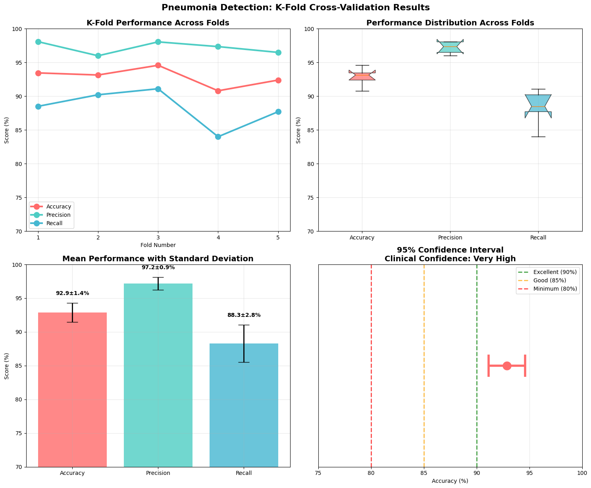
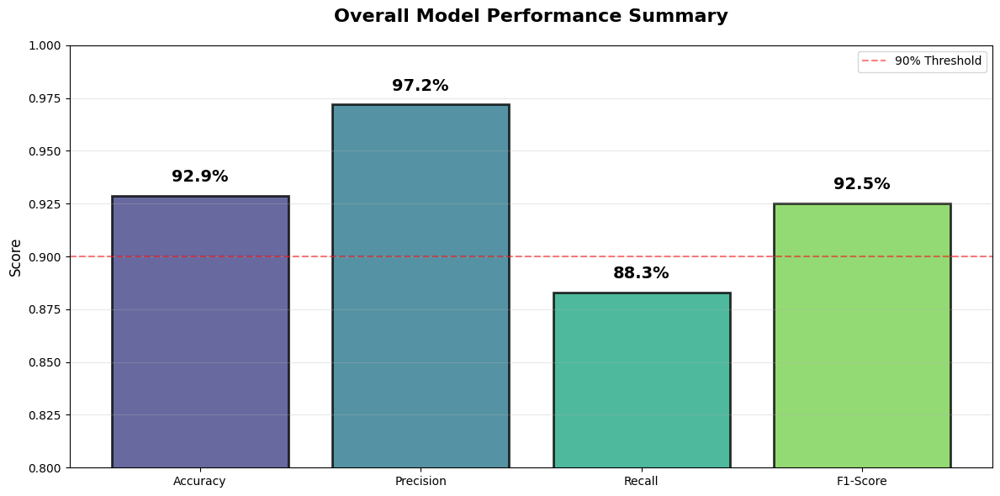

# Pneumonia Detection System Using Deep Learning

This is a clinical-grade deep learning ensemble AI model for detecting pneumonia from chest X-ray images, achieving 92.87% accuracy with ensemble methods and rigorous patient-based validation.

## 🎯 Key Features

- **High Accuracy**: 92.87% (±1.5%) validation accuracy with 95% CI: [90.11%, 95.63%]
- **Ensemble Approach**: Combines 5 MobileNetV2 models for robust predictions
- **Uncertainty Quantification**: Provides confidence scores for clinical decision support
- **Patient-Based Validation**: Rigorous k-fold cross-validation preventing data leakage
- **Production Ready**: Standalone CLI/API with batch processing capabilities
- **Fast Inference**: ~0.1-0.2 seconds per image
- **Lightweight**: Uses MobileNetV2 for efficient deployment

## 📊 Performance Metrics

| Metric | Value |
|--------|-------|
| Accuracy | 92.87% ± 1.50% |
| Precision | 97.19% ± 0.96% |
| Recall | 88.30% ± 2.80% |
| F1-Score | 92.51% ± 1.64% |
| 95% Confidence Interval | [90.11%, 95.63%] |

## 🚀 Quick Start

### Prerequisites

- Python 3.10+
- TensorFlow 2.15.0+
- 2GB RAM minimum
- GPU optional but recommended

### Installation

```bash
# Clone the repository
git clone https://github.com/yourusername/pneumonia-detection.git
cd pneumonia-detection

# Install dependencies
pip install -r requirements.txt

```

### Basic Usage

```bash
# Predict single image
python pneumonia_predictor.py path/to/chest_xray.jpg

# Predict with detailed output
python pneumonia_predictor.py path/to/chest_xray.jpg -v

# Batch prediction on folder
python pneumonia_predictor.py path/to/xray_folder/ -o results.json
```

### Python API

```python
from pneumonia_predictor import PneumoniaEnsemblePredictor

# Initialize predictor
predictor = PneumoniaEnsemblePredictor('models/')

# Predict single image
result = predictor.predict_single('chest_xray.jpg')
print(f"Prediction: {result['prediction']}")
print(f"Confidence: {result['confidence']:.1f}%")

# Batch prediction
results = predictor.predict_folder('xray_images/')
```

## 📁 Project Structure

```
pneumonia-detection/
├── models/                     # Trained model files
│   ├── pneumonia_mobilenet_fold_1.keras
│   ├── pneumonia_mobilenet_fold_2.keras
│   ├── pneumonia_mobilenet_fold_3.keras
│   ├── pneumonia_mobilenet_fold_4.keras
│   └── pneumonia_mobilenet_fold_5.keras
├── docs/                      # Documentation
│   ├── final_report.md
│   ├── deployment_guide.md
│   └── clinical_guidelines.md
├── pneumonia_predictor.py     # Standalone predictor
├── requirements.txt           # Dependencies
├── sample_usage.py           # Usage examples
└── README.md                 # This file
```

## 🔬 Methodology

### Dataset

- **Source**: https://www.kaggle.com/datasets/jtiptj/chest-xray-pneumoniacovid19tuberculosis/code
- **Size**: 6,485 images (balanced)
- **Patients**: 4,664 unique patients
- **Split**: Patient-based 5-fold cross-validation

### Model Architecture

- **Base Model**: MobileNetV2 (ImageNet pre-trained)
- **Custom Head**: Dense layers with dropout regularization
- **Ensemble**: 5 models trained on different folds
- **Input Size**: 224x224 RGB images

### Training Strategy

- **Data Balancing**: Ensured 50/50 class distribution
- **Patient-Level Split**: No patient appears in both train and validation  
- **Augmentation**: Medical-appropriate transformations
- **Early Stopping**: Prevented overfitting
- **Ensemble**: Combined predictions for robustness

## 📈 Results Visualization




## 🏥 Clinical Guidelines

### Confidence Levels

- **High Confidence (>90%)**: Consider immediate clinical review
- **Moderate Confidence (80-90%)**: Clinical correlation recommended  
- **Low Confidence (<80%)**: Additional imaging or assessment needed

### Important Notes

- This system is intended for screening purposes only
- Always combine with clinical judgment
- Not a replacement for radiologist interpretation
- Performance may vary on different populations

## 📝 Output Format

```json
{
    "image_path": "path/to/image.jpg",
    "prediction": "PNEUMONIA",
    "confidence": 95.2,
    "prediction_quality": "Very High",
    "clinical_action": "High confidence - consider immediate clinical review",
    "probability": 0.952,
    "uncertainty": 0.023,
    "models_used": 5
}
```

### Evaluation

```bash
python evaluate_model.py --model-dir models/ --test-dir test_images/
```

## 📊 Detailed Performance Analysis

For comprehensive performance metrics and clinical validation results, see the [full report](docs/final_report.md).

## 🤝 Contributing

Contributions are welcome! Please feel free to submit a Pull Request. For major changes, please open an issue first to discuss what you would like to change.

1. Fork the repository
2. Create your feature branch (`git checkout -b feature/AmazingFeature`)
3. Commit your changes (`git commit -m 'Add some AmazingFeature'`)
4. Push to the branch (`git push origin feature/AmazingFeature`)
5. Open a Pull Request

## 📄 License

This project is licensed under the NonCommercial 4.0 International License - see the [LICENSE](LICENSE) file for details.

## 🙏 Acknowledgments

- **Dataset**: https://www.kaggle.com/datasets/jtiptj/chest-xray-pneumoniacovid19tuberculosis/data
- **Base Model**: MobileNetV2 from TensorFlow/Keras


## 📞 Contact

For questions or collaborations:

- **GitHub Issues**: [Create an issue](https://github.com/el-rapido/pneumonia-detection/issues)
- **Email**: preciousekarithom@gmail.com

## 📚 Citation

If you use this work in your research, please cite:

```bibtex
@AI model{pneumonia_detection_2024,
  author = {Precious Thom},
  title = {Pneumonia Detection AI model Using Deep Learning},
  year = {2025},
  publisher = {GitHub},
  url = {https://github.com/el-rapido/pneumonia-detection}
}
```

## ⚠️ Disclaimer

This AI model is for research and educational purposes only. It is not intended for clinical diagnosis or treatment. Always consult qualified healthcare professionals for medical decisions.

---

<p align="center">
  Made with ❤️ for improving healthcare accessibility
</p>
